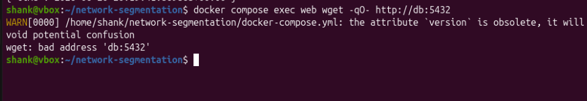
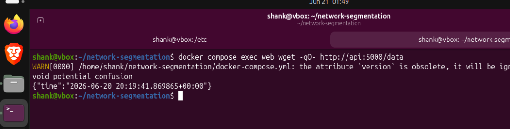
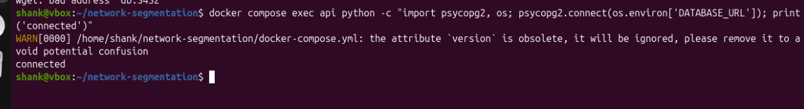

# network-segmentation

A three-tier containerised application (web → api → database) built with Docker Compose, demonstrating network segmentation as a security control. Built as part of Phase 2 (Docker & Containers) of a DevSecOps learning roadmap.

The core idea: enforce network isolation between tiers so that a compromised frontend container has no direct path to the database. The API layer remains the only translator between them.

---

## Architecture

```
Internet
    │
    ▼
[ web: nginx ]  ── frontend-net ──  [ api: python/flask ]  ── backend-net ──  [ db: postgres ]
    │                                        │
 port 8080                               expose 5000                          expose 5432
 (localhost only)                      (internal only)                       (internal only)
```

Two isolated bridge networks:

- `frontend-net` — web and api only
- `backend-net` — api and db only

`web` and `db` share no network. DNS for `db` does not resolve from inside the `web` container — not a firewall rule, not a policy — the network namespace simply doesn't contain it.

---

## Threat model

### Without segmentation (all services on default bridge)

1. Attacker exploits a vulnerability in nginx or the frontend
2. Gets a shell inside the `web` container
3. Directly connects to `db:5432` — no firewall between them on the default bridge
4. Runs queries against the database, bypassing the API's auth and input validation entirely

### With segmentation (this setup)

1. Attacker compromises the `web` container
2. `db` is unreachable — DNS doesn't resolve, TCP connection never established
3. Attacker must chain a second exploit through the API layer
4. The API's validation, authentication, and rate limiting remain in the path
5. Blast radius is contained to the frontend tier

---

## Project structure

```
network-segmentation/
├── web/
│   └── nginx.conf             # Reverse proxy to api:5000
├── api/
│   ├── app.py                 # Flask app — reads from postgres
│   ├── requirements.txt
│   └── Dockerfile
├── secrets/
│   └── db_password.txt        # Not committed — add to .gitignore
├── .env                       # DB_PASS — not committed
├── .dockerignore
└── docker-compose.yml
```

---

## Services

### web (nginx)
- Reverse proxies all traffic to `api:5000`
- Bound to `127.0.0.1:8080` on the host — not exposed to `0.0.0.0`
- `read_only: true` filesystem with tmpfs for nginx cache and pid dirs
- Only on `frontend-net` — no route to `db`

### api (Python / Flask)
- Connects to postgres and returns a JSON response
- Exposed internally on port 5000 via `expose:` — never published to the host
- Runs as non-root user (`apiuser`)
- Sits on both networks — intentionally, as the only service that bridges tiers

### db (PostgreSQL 16 Alpine)
- Only on `backend-net` — completely invisible to `web`
- Uses `expose:` not `ports:` — port 5432 is never published to the host
- Data persisted via named volume `pgdata`
- Healthcheck gates api startup

---

## Security decisions

| Decision | Why |
|---|---|
| Two isolated networks | `web` cannot reach `db` at the network level — no firewall rule to misconfigure |
| `expose:` on api and db | Ports are internal only — not reachable from the host or the internet |
| `ports: 127.0.0.1:8080:80` | Binds to localhost only — Docker's default `0.0.0.0` binding bypasses UFW |
| `read_only: true` on web | Attacker who compromises nginx can't write to the container filesystem |
| Non-root user in api | Process runs as `apiuser`, not UID 0 |
| `DB_PASS` via `.env` | Password never hardcoded in compose file or image |
| `depends_on` + healthcheck | api only starts after postgres is confirmed ready — not just started |

---

## Verification

### Test 1 — web cannot reach db (segmentation proof)

```bash
docker compose exec web wget -qO- http://db:5432
```



`wget: bad address 'db:5432'` — DNS does not resolve. `db` is not on `frontend-net`, so it doesn't exist from `web`'s perspective. This is the core security property being demonstrated.

### Test 2 — web can reach api (frontend tier works)

```bash
docker compose exec web wget -qO- http://api:5000/data
```



Returns `{"time":"2026-06-20 20:19:41.869865+00:00"}` — nginx successfully proxies to the Flask API, which queries postgres and responds.

### Test 3 — api can reach db (backend tier works)

```bash
docker compose exec api python -c "import psycopg2,os; psycopg2.connect(os.environ['DATABASE_URL']); print('connected')"
```



`connected` — api reaches postgres over `backend-net` as expected.

### Inspect network topology

```bash
docker network inspect network-segmentation_frontend-net
docker network inspect network-segmentation_backend-net
```

`frontend-net` contains: `web`, `api`
`backend-net` contains: `api`, `db`

`db` never appears on `frontend-net`. `web` never appears on `backend-net`.

---

## Running the stack

```bash
# Set the db password
echo "DB_PASS=changeme123" > .env
echo "changeme123" > secrets/db_password.txt

# Start
docker compose up -d

# Verify all three containers are running
docker compose ps

# Tear down (volumes preserved)
docker compose down

# Tear down including data volume
docker compose down -v
```

---

## What this connects to

This project is the foundation for Phase 3 security integration work:

- **Trivy** will scan the api image for CVEs in the same way Project 1 demonstrated
- **Falco** will monitor runtime behaviour — alerting if any container spawns an unexpected shell or reads sensitive files
- **Secrets management** — the `.env` / `secrets/` approach here gets replaced by a proper secrets manager (Vault or AWS Secrets Manager) in cloud deployments
- **TLS between services** — in production, api↔db traffic would be encrypted; the network segmentation here is a defence-in-depth layer, not a substitute for encryption

The network topology built here (frontend / backend zone separation) maps directly to the VPC subnet model used in cloud environments — public subnet for the load balancer, private subnet for the app tier, isolated subnet for the database. Same mental model, different implementation.
